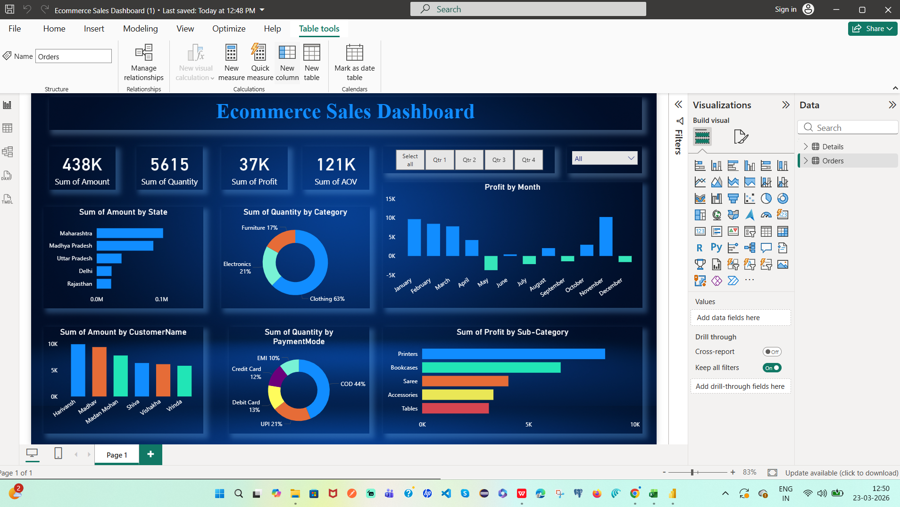

# 📊 Ecommerce Sales Dashboard (Power BI)

## 🔥 Project Overview
This project is a Power BI dashboard built to analyze ecommerce sales performance.

## 🎯 Key Features
- Total Sales, Profit, Quantity KPIs
- Region-wise and Category-wise analysis
- Dynamic filters (slicers)
- Profit trend over time
- Top-performing products

## 🛠️ Tools Used
- Power BI
- DAX
- Data Modeling

## 📂 Files Included
- Ecommerce Sales Dashboard.pbix
- Dataset (if applicable)

## 📸 Dashboard Preview

## 💡 Insights
- Identified top revenue-generating regions
- Found high-profit product categories
- Detected sales trends over time

## 🚀 How to Use
1. Download `.pbix` file
2. Open in Power BI Desktop
3. Explore dashboard interactively

---

⭐ If you like this project, give it a star!